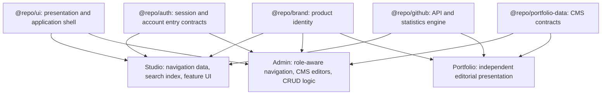

# Studio, Admin, and Portfolio Sharing Audit

## Decision

Studio and Admin should behave as sibling product applications built on one
configurable application-shell system. Portfolio remains a standalone public
experience with its own layout, typography, motion, and CSS. Portfolio can
still share non-visual contracts and infrastructure where the behavior is truly
the same.

The Studio/Admin visual work belongs primarily in `@repo/ui`, with session
mechanics in `@repo/auth` and identity in `@repo/brand`. Cross-application data
behavior should not be placed in `@repo/ui`; the Portfolio CMS contract and
GitHub data engine deserve small, React-free packages of their own.

## Evidence from the current codebase

Studio and Admin already consume the same sidebar primitives and
`ApplicationShell`, but the shell stops before the areas that are now visibly
converging: nested navigation, the top bar, theme controls, account controls,
search/command presentation, and common page states.

The original audit found 10 byte-identical files across the two applications,
representing 1,023 duplicated lines. The account-settings slice has since been
retired from both product apps rather than extracted as shared legacy UI:

| Duplicate area | Files / lines | Correct destination |
| --- | ---: | --- |
| Account settings and MFA | Retired from Studio/Admin | Auth-owned account surface; local MFA verification remains only for compatibility |
| Circular loader | 1 file / 70 lines | `@repo/ui` |
| Global error | 1 file / 47 lines | Shared error presentation with thin app wrappers |
| Route loading wrappers | 2 files / 14 lines | Shared loading presentation with thin Next.js wrappers |
| Browser Supabase wrapper | 1 file / 1 line | Import `@repo/auth/browser` directly or retain only as an app alias |

Additional near-duplicates include the theme toggle, sidebar user menu, account
API routes, breadcrumb presentation, confirmation patterns, and layout wiring.
These should not all be treated alike: some are durable UI contracts; others
are temporary duplication around the in-progress Auth application cutover.

## Portfolio boundary audit

### Visual result

The Portfolio visual layer is already properly isolated:

- No TypeScript, TSX, or CSS source file in Portfolio is byte-identical to a
  Studio or Admin source file.
- Portfolio's public navigation, mobile menu, page header, project stories,
  certificate deck, contribution map, contact form, Blog, and article renderer
  are editorial components with their own DOM and CSS.
- Portfolio uses DM Sans and Instrument Serif; Studio uses Manrope and IBM Plex
  Mono; Admin is moving toward the Studio application typography. These roles
  should remain separate.
- Portfolio imports `@repo/ui` only for the generic buttons on its error and 404
  pages. Those fallback pages currently sit outside the editorial visual
  language and should become local Portfolio states, allowing the public app to
  remove its visual dependency on `@repo/ui`.

The conclusion is not “share no code with Portfolio.” It is “share no public
visual system with Portfolio.”

### High-value shared Portfolio contracts

#### Portfolio CMS data contract

Admin and Portfolio currently describe the same database rows separately:

- Admin keeps mutable row interfaces in `apps/admin/src/lib/types.ts`.
- Portfolio declares its own query row types in
  `apps/portfolio/src/lib/portfolio/editorial-server.ts` and then maps them into
  public presentation types.
- Section keys, skill proficiency values, Blog fields, social-link shapes, and
  visibility/sort semantics are therefore duplicated without one compile-time
  contract.

Create a React-free `@repo/portfolio-data` package containing:

- canonical database row and write-input types;
- the section-key registry and public section order;
- enum-like values such as skill proficiency;
- shared select-column constants and narrow runtime guards for JSON fields;
- the Blog row/write contract used by Admin and Portfolio.

Keep Portfolio's public view models and mapping into editorial cards, timelines,
and paper treatments inside Portfolio. Keep Admin form state and mutation logic
inside Admin. The shared package is the synchronization boundary, not a shared
screen library.

This is the most important Portfolio-related extraction because it prevents the
CMS from exposing a field the public site ignores—or the public site requiring
a field the Admin cannot edit.

#### GitHub data engine

GitHub statistics are implemented three times today:

- Studio's `lib/github-stats` types, API client, server fetcher, and compute
  functions;
- Portfolio's copied `lib/github-stats` implementation used by API routes;
- Portfolio's newer, smaller `lib/github` server implementation used during
  page rendering.

Including the paired API routes, these implementations total approximately
1,170 lines around the same GitHub user/repository/language behavior. The
Studio and Portfolio proxy and LOC routes are logically identical apart from
formatting.

Create a React-free `@repo/github` package containing:

- GitHub response types;
- server fetch, pagination, cache, and rate-limit handling;
- pure repository/language/LOC computations;
- a safe proxy-handler factory only if both applications still need client
  proxy routes.

Studio and Portfolio should retain different presentation components. The
Studio dashboard card and the Portfolio editorial contribution/code story have
different hierarchy, controls, themes, and goals; sharing those views would be
the wrong abstraction.

#### Brand assets and metadata

Six favicon/PWA asset files are copied byte-for-byte across Portfolio, Studio,
and Admin—18 physical files in total. Their metadata arrays are also repeated
in layouts and manifests.

Make `@repo/brand` the source of truth for icon path metadata and canonical
asset files. Because each independently deployed Next.js application may still
need local public files, use a small sync/check step rather than runtime imports
that make static delivery fragile.

The Open Graph compositions remain app-owned. Portfolio and Studio deliberately
tell different visual stories even though they use the same identity asset.

#### Neutral runtime infrastructure

Portfolio can reuse non-visual infrastructure when it does not influence the
rendered design:

- shared SEO and canonical-host helpers (`@repo/seo` and `@repo/platform`) —
  already correctly shared;
- brand and person identity (`@repo/brand`) — already correctly shared;
- ESLint, TypeScript, Tailwind build plumbing, and monorepo tasks — already
  correctly shared;
- the `LazyMotionProvider` runtime after Portfolio's motion usage is converted
  and visually regression-tested;
- pure date normalization for Blog publish timestamps, provided the Admin form
  retains local-time editing and Portfolio retains its editorial display format.

Portfolio currently declares `next-themes`, `sonner`, and `simple-icons` without
importing them. Remove those direct dependencies during cleanup. If the local
editorial error/404 actions replace `@repo/ui/button`, remove Portfolio's
`@repo/ui` dependency and its `transpilePackages` entry as well.

## What should become shared

### 1. Application frame

Extend `@repo/ui/application-shell` into a complete, configuration-driven
frame:

- `ApplicationShell` — sidebar provider, inset, sticky top bar, content frame.
- `ApplicationSidebar` — brand, grouped sections, utility footer, collapse
  behavior.
- `ApplicationNavigationTree` — supports both Admin's flat sections and
  Studio's nested application navigation without importing either app's route
  config.
- `ApplicationTopbar` — sidebar toggle, breadcrumb slot, search/command slot,
  theme control, and user-control slot.
- `ApplicationCommandMenu` — shared dialog, keyboard behavior, result groups,
  empty state, and navigation behavior; each app supplies its own searchable
  items.
- `ApplicationThemeMenu` — one accessible light/dark/system control.
- `ApplicationUserMenu` — avatar and menu presentation with actions injected by
  the app or `@repo/auth`.

The shared components must accept data and callbacks. They must not import
Studio hub configuration, Admin roles, Supabase clients, or application route
maps.

### 2. Page composition

Add a small set of page-level presentation primitives to keep new Studio and
Admin screens consistent:

- `WorkspaceHeader` — eyebrow, title, description, status/details, and action
  slots. Generalize Studio's current workspace header rather than duplicating
  it for Admin.
- `PageToolbar` — search, filter, view, and primary-action slots.
- `ResourceList` / `ResourceRow` — consistent collection framing only; data,
  forms, optimistic state, and mutations stay in the owning app.
- `EmptyState`, `ApplicationErrorState`, and the existing `PageSpinner`.
- `ConfirmationDialog` — replace browser `window.confirm` calls with a common,
  accessible destructive-action contract.
- `StatusBadge`, `VisibilityBadge`, and `IconAction` — common semantics and
  accessibility for repeated CRUD controls.

### 3. Low-level UI primitives

The following generic components currently live under Studio even though they
are not Studio concepts and Admin can reuse them during its redesign:

- Checkbox
- Context menu
- Progress
- Scroll area
- Table

Move these to `@repo/ui` and move their Radix dependencies with them. Studio's
feature-specific animated counter, flip text, logo slider, and typewriter stay
inside Studio.

### 4. Product-application visual foundation

Create an application-surface stylesheet consumed by Studio and Admin only. It
should carry the shared warm light palette, neutral dark palette, shell border
and elevation rules, sidebar density, and the Manrope / IBM Plex Mono type
roles already established in Studio.

Do not move feature animation CSS into that file. Admin currently contains
unused copied logo-slider, flip-character, marquee, and fade rules; remove
those rules instead of promoting them to shared CSS.

Portfolio must not import the application-surface stylesheet or inherit these
tokens. Its DM Sans / Instrument Serif editorial identity remains independent.

### 5. Supporting package improvements

- A safe server-only service-role client factory now lives at
  `@repo/auth/service-role`; Admin and Studio routes use it without moving
  authorization or business mutations into the shared package.
- Keep authorization policy, proxy behavior, and role filtering app-owned.
- Put repeated favicon/metadata identity in `@repo/brand`.
- Keep the Tailwind base shared, but let Studio/Admin opt into the shared
  application-surface CSS. A shared Tailwind config must not imply shared
  Portfolio styling.

## What should not become shared

| Keep app-owned | Reason |
| --- | --- |
| Studio product inventory, tools, games, workspace navigation data | Product-specific information architecture and interaction |
| Admin portfolio editors, upload flows, deployment actions, and role-aware navigation data | CMS domain and authorization behavior |
| Portfolio navigation, mobile menu, section headings, project stories, certificate deck, contact form, Blog/article layout, and motion choreography | Public editorial identity and storytelling behavior |
| Breadcrumb route resolution | Labels and hierarchy are application-specific; only the visual trail is shared |
| Search indexes | Studio searches products/tools; Admin searches content and management destinations |
| Supabase fetching, mutations, and optimistic state | Shared UI should not own business logic or database schemas |
| File conflicts, project editors, and other domain dialogs | Their state machines and copy are not generic confirmation UI |
| Portfolio components, global CSS, fonts, navigation, motion, and data presentation | Portfolio is a public editorial experience, not a product shell |

## Legacy account code: delete, do not share

The exact Account Settings and MFA duplicates account for 891 of the 1,023
duplicate lines. Extracting them into `@repo/ui` would make a transitional
architecture permanent.

The Auth application already owns account security, password management, MFA,
providers, and logout entry contracts. The correct path is:

1. Complete the Auth cutover for Studio and Admin account destinations.
2. Route user-menu actions through `@repo/auth/entry`.
3. Remove the duplicated Account Settings sheets, MFA components, and account
   cleanup endpoints from Studio and Admin after behavioral parity is verified.

Only the neutral user-menu presentation belongs in `@repo/ui`.

## Recommended implementation sequence

### Phase 1 — shared foundation

1. Add the shared application-surface CSS and shell typography contract.
2. Extend `ApplicationShell` with recursive navigation, top-bar slots, collapse
   controls, theme menu, and user-menu presentation.
3. Move the generic Studio UI primitives into `@repo/ui`.
4. Add the shared loading, error, empty, confirmation, badge, and icon-action
   components.

In parallel, create the React-free Portfolio data and GitHub packages. These
packages do not block the Studio/Admin shell, but they should land before the
CMS schema migration so Admin and Portfolio move to one contract together.

### Phase 2 — Admin redesign adoption

1. Migrate Admin to the full shared shell while keeping role-aware navigation
   config in Admin.
2. Use the shared page composition primitives for the new section-owned
   Portfolio CMS workspaces.
3. Remove unused Studio animation CSS from Admin.

Admin is the best first adopter because its shell and Portfolio workspaces are
already being redesigned; this validates the API without destabilizing the
larger Studio application.

### Phase 3 — Studio convergence

1. Replace Studio's local shell wiring with the same shared contracts.
2. Supply Studio's nested hub configuration and command data through adapters.
3. Preserve Studio-only visual treatments and feature navigation behavior.

### Phase 4 — Auth cutover and cleanup

1. Verify account, MFA, deletion, and logout parity through Auth.
2. Remove the duplicated legacy account components and API routes.
3. Remove one-line wrappers and metadata/config duplicates where they no longer
   provide a useful application boundary.

### Phase 5 — Portfolio infrastructure cleanup

1. Move Admin and Portfolio onto the canonical Portfolio data contract.
2. Move Portfolio and Studio onto the canonical GitHub data engine and delete
   the three local implementations.
3. Centralize brand icon metadata and add an asset synchronization check.
4. Replace generic Portfolio error/404 buttons with local editorial actions and
   remove unused Portfolio product-app dependencies.
5. Verify that the public Portfolio DOM, typography, layout, motion, and CSS are
   unchanged outside the intentionally refined fallback pages.

## Acceptance checks

- Studio and Admin render from the same shell components in light, dark, desktop,
  collapsed-sidebar, and mobile states.
- Each application supplies its own navigation, active-route logic, search
  entries, user actions, and permissions.
- Keyboard navigation, focus visibility, tooltips, dialogs, and mobile sidebar
  dismissal are consistent.
- No shared component imports from `apps/studio` or `apps/admin`.
- Portfolio does not import the application shell or application-surface CSS,
  and its rendered appearance is unchanged.
- Admin and Portfolio compile against one canonical CMS row/write contract.
- Studio and Portfolio consume one GitHub data engine while rendering separate
  application-specific views.
- Portfolio contains no unused `next-themes`, `sonner`, or `simple-icons`
  dependencies and no product-shell CSS.
- Auth owns the account settings surface (profile, password, MFA, providers,
  and logout); product account-delete endpoints remain only until an approved
  Auth-owned self-delete operation exists.
- Type checks, lint, focused tests, and responsive browser validation pass for
  both product applications.

## Outcome

The target is not “make every application look the same.” The target is one
durable product-application foundation for Studio and Admin, one canonical data
contract between Admin and Portfolio, and one GitHub engine behind two distinct
presentations. Portfolio stays visually separate by design.
